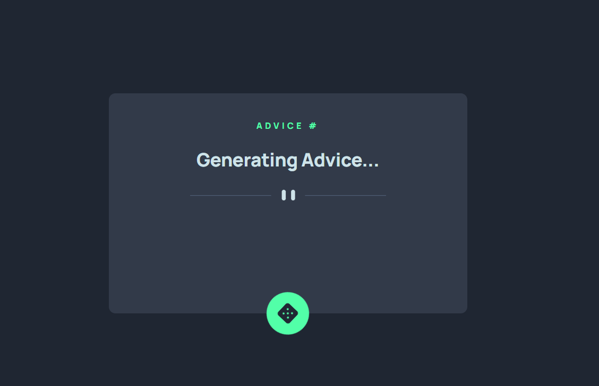
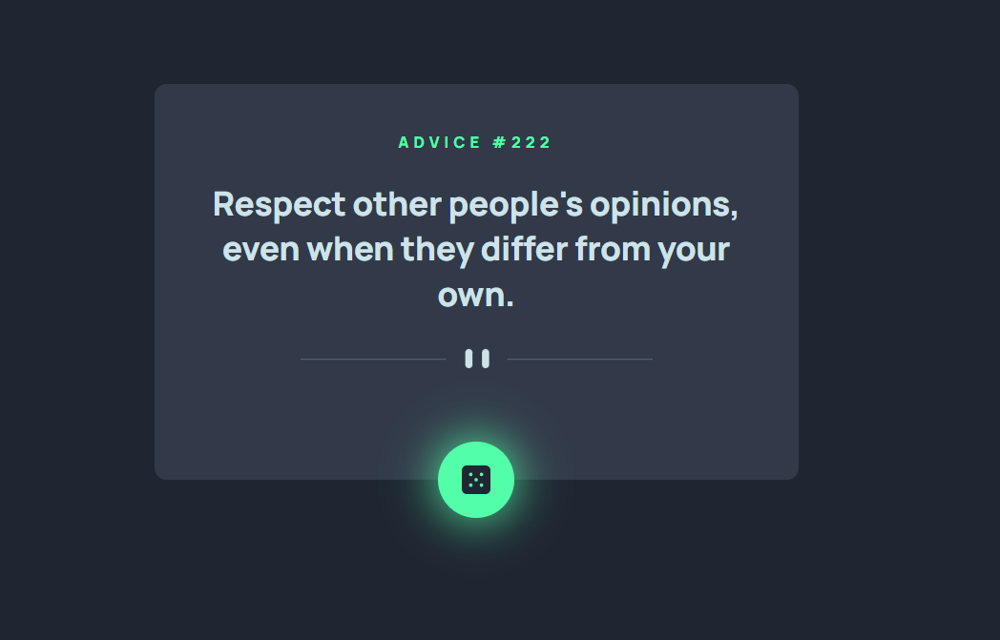

# Frontend Mentor - Advice generator app solution

This is a solution to the [Advice generator app challenge on Frontend Mentor](https://www.frontendmentor.io/challenges/advice-generator-app-QdUG-13db).

## Table of contents

- [Overview](#overview)
  - [The challenge](#the-challenge)
  - [Screenshot](#screenshot)
  - [Links](#links)
- [Process](#process)
  - [Built with](#built-with)
- [Author](#author)

## Overview

### The challenge

Users should be able to:

- View the optimal layout for the app depending on their device's screen size
- See hover states for all interactive elements on the page
- Generate a new piece of advice by clicking the dice icon

### Screenshot

<figure>
  <figcaption style="text-align:center;">Loading advice - Screenshot 1</figcaption>
  
</figure>

<figure>
  <figcaption style="text-align:center;">Advice - Screenshot 2</figcaption>
  
</figure>

### Links

- Solution URL: [Frontmentor.io Solution](https://www.frontendmentor.io/solutions/advice-generator-app-X_DZvgLbby)
- Live Site URL: [Solution Live Site](https://advice-generator-app-amber.vercel.app/)

## Process

### Built with

- Semantic HTML5 markup
- Mobile-first workflow
- [React](https://reactjs.org/) - JS library
- [Sass](https://sass-lang.com/) - For styles
- [@axe-core/react](https://www.npmjs.com/package/@axe-core/react) to ensure accessibility

## Author

- Linkedin - [David do Carmo](https://www.linkedin.com/in/davidscarmo/)
- Frontend Mentor - [@davidscarmo](https://www.frontendmentor.io/profile/davidscarmo)
